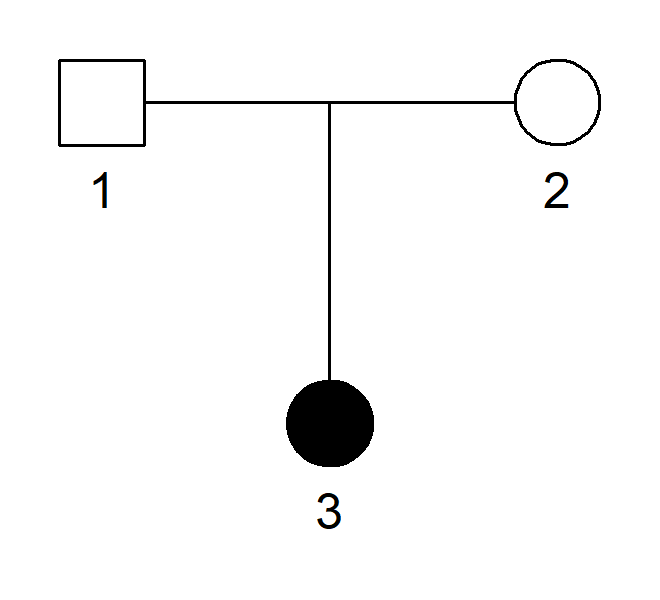

<!-- README.md is generated from README.Rmd. Please edit that file -->

# QuickPed

<!-- badges: start -->
<!-- badges: end -->

To use QuickPed, visit <https://magnusdv.shinyapps.io/quickped>.

## What is QuickPed?

QuickPed is a web application for creating and plotting pedigrees on the
fly. Once the pedigree is created it may be saved as an image, or as a
text file in *ped format* (see below). You may also obtain various
information about the pedigree, including coefficients of inbreeding,
kinship and identity-by-descent.

QuickPed is powered by the
[pedtools](https://github.com/magnusdv/pedtools) package and imports
[kinship2](https://CRAN.R-project.org/package=kinship2) for plotting.

## Pairwise relationships

The *Relationships* feature of QuickPed provides information about
pairwise relationships within the current pedigree. After selecting any
two pedigree members, the user may click either `Coeffs` or `Describe`:

-   `Coeffs`: This prints a variety of pedigree coefficients describing
    the relationship:

    -   The inbreeding coefficient of each individual (this works for
        any number of selected members).
    -   The kinship coefficient *φ*.
    -   The IBD coefficients
        *κ* = (*κ*0, *κ*1, *κ*2),
        defined as the probabilities of sharing 0, 1, and 2 alleles
        identical by descent (IBD). These are well-defined only if both
        individuals are non-inbred.
    -   The 9 condensed identity coefficients of Jacquard,
        *Δ* = (*Δ*1, ..., *Δ*9).

    More information about these coefficients can be found in the
    documentation of the [ribd](https://github.com/magnusdv/ribd)
    package, which is used in the calculations.

-   `Describe`: This prints a verbal description of the relationship,
    generated by [verbalisr](https://github.com/magnusdv/verbalisr).
    (NB: This is still work in progress.)

## What is *ped format*?

A useful feature of QuickPed is to produce text files describing
pedigrees in so-called *ped format*. Such files are often required by
software for pedigree analysis.

For a simple illustration, consider this pedigree:

A text file describing this pedigree may contain the following.

     id fid mid sex aff
      1   0   0   1   1
      2   0   0   2   1
      3   1   2   2   2

The columns are:

-   `id`: Individual ID
-   `fid`: Father’s ID (or 0 if not included in the pedigree)
-   `mid`: Mother’s ID (or 0 if not inlcuded in the pedigree)
-   `sex`: Sex (1 = male; 2 = female; 0 = unknown)
-   `aff`: Affection status (1 = unaffected; 2 = affected; 0 = unknown)

It should be noted that the ped format is not completely standardised,
and different software may use slightly different versions. For example,
a first column with *Family ID* is sometimes required. Also, the `aff`
column may not be needed in non-medical applications. These and other
details may be specified when using QuickPed.
